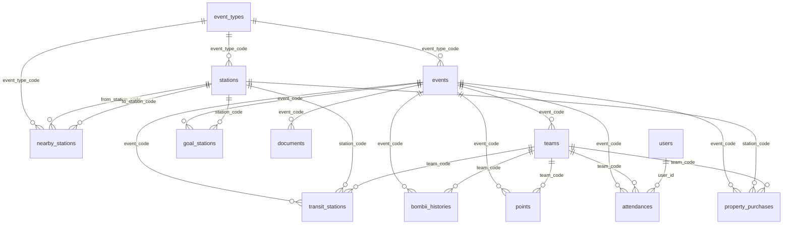

# データベース定義書

## 目次

- [Enum 一覧](#enum-一覧)
- [テーブル一覧](#テーブル一覧)
    - [users](#users)
    - [event_types](#event_types)
    - [events](#events)
    - [stations](#stations)
    - [nearby_stations](#nearby_stations)
    - [teams](#teams)
    - [goal_stations](#goal_stations)
    - [transit_stations](#transit_stations)
    - [bombii_histories](#bombii_histories)
    - [points](#points)
    - [documents](#documents)
    - [attendances](#attendances)
    - [property_purchases](#property_purchases)
- [ビュー一覧](#ビュー一覧)
    - [latest_transit_stations](#latest_transit_stations)
    - [bombii_counts](#bombii_counts)
- [ER図](#er図)

---

## Enum 一覧

### VisibilityLevel（表示レベル）

| 値            | 説明                     |
| ------------- | ------------------------ |
| `hidden`      | 非公開                   |
| `admin`       | 管理者以上に公開         |
| `organizer`   | イベント管理者以上に公開 |
| `participant` | 参加者以上に公開         |

### OperationLevel（操作権限レベル）

| 値            | 説明                       |
| ------------- | -------------------------- |
| `readonly`    | 読み取り専用               |
| `admin`       | 管理者以上が操作可         |
| `organizer`   | イベント管理者以上が操作可 |
| `participant` | 参加者以上が操作可         |

### Role（ユーザーロール）

| 値      | 説明         |
| ------- | ------------ |
| `user`  | 一般ユーザー |
| `admin` | 管理者       |

### StationType（駅種別）

| 値         | 説明           |
| ---------- | -------------- |
| `mission`  | ミッション駅   |
| `plus`     | プラス駅       |
| `minus`    | マイナス駅     |
| `treasure` | 宝くじ駅       |
| `card`     | カード売り場駅 |

### StationGrade（駅グレード）

| 値     | 説明         |
| ------ | ------------ |
| `none` | グレードなし |
| `a`    | Aグレード    |
| `b`    | Bグレード    |
| `c`    | Cグレード    |

### PointStatus（ポイントステータス）

| 値         | 説明         |
| ---------- | ------------ |
| `points`   | 保有ポイント |
| `scored`   | 総資産       |
| `property` | 物件評価額   |
| `revenue`  | 収益         |

---

## テーブル一覧

### users

ユーザー情報。Supabase Auth と連携する。

| カラム名      | 型               | デフォルト    | NOT NULL | UNIQUE | FK  | 説明                     |
| ------------- | ---------------- | ------------- | :------: | :----: | --- | ------------------------ |
| `id`          | `integer`        | autoincrement |    ✓     |   —    | —   | PK                       |
| `uuid`        | `text`           | —             |    ✓     |   ✓    | —   | Supabase Auth ユーザーID |
| `email`       | `text`           | —             |    ✓     |   ✓    | —   | メールアドレス           |
| `nickname`    | `text`           | —             |    —     |   —    | —   | ニックネーム             |
| `icon_url`    | `text`           | —             |    —     |   —    | —   | アイコン画像URL          |
| `master_role` | `Role`           | `user`        |    ✓     |   —    | —   | 恒久的なロール           |
| `created_at`  | `timestamptz(3)` | now()         |    ✓     |   —    | —   | 作成日時                 |
| `updated_at`  | `timestamptz(3)` | now()         |    ✓     |   —    | —   | 更新日時                 |

---

### event_types

イベント種別マスタ。路線図設定ファイルやバージョン情報を保持する。

| カラム名          | 型               | デフォルト    | NOT NULL | UNIQUE | FK  | 説明                             |
| ----------------- | ---------------- | ------------- | :------: | :----: | --- | -------------------------------- |
| `id`              | `integer`        | autoincrement |    ✓     |   —    | —   | PK                               |
| `event_type_code` | `text`           | —             |    ✓     |   ✓    | —   | 種別コード                       |
| `description`     | `text`           | —             |    —     |   —    | —   | 説明                             |
| `routemap_config` | `text`           | —             |    —     |   —    | —   | 路線図設定ファイルパス           |
| `version`         | `integer`        | `100`         |    —     |   —    | —   | バージョン番号（例: 100 = v1.0） |
| `created_at`      | `timestamptz(3)` | now()         |    ✓     |   —    | —   | 作成日時                         |
| `updated_at`      | `timestamptz(3)` | now()         |    ✓     |   —    | —   | 更新日時                         |

---

### events

イベント情報。表示・操作権限、Discord通知設定を保持する。

| カラム名                  | 型                | デフォルト    | NOT NULL | UNIQUE | FK                          | 説明                    |
| ------------------------- | ----------------- | ------------- | :------: | :----: | --------------------------- | ----------------------- |
| `id`                      | `integer`         | autoincrement |    ✓     |   —    | —                           | PK                      |
| `event_code`              | `text`            | —             |    ✓     |   ✓    | —                           | イベントコード          |
| `event_type_code`         | `text`            | —             |    ✓     |   —    | event_types.event_type_code |                         |
| `event_name`              | `text`            | —             |    ✓     |   —    | —                           | イベント名              |
| `start_date`              | `timestamptz(3)`  | —             |    —     |   —    | —                           | 開始日時                |
| `visibility_level`        | `VisibilityLevel` | `hidden`      |    ✓     |   —    | —                           | 表示レベル              |
| `operation_level`         | `OperationLevel`  | `readonly`    |    ✓     |   —    | —                           | 操作権限レベル          |
| `discord_webhook_url`     | `text`            | サンプルURL   |    ✓     |   —    | —                           | Discord Webhook URL     |
| `is_notification_enabled` | `boolean`         | `false`       |    ✓     |   —    | —                           | Discord通知の有効フラグ |
| `created_at`              | `timestamptz(3)`  | now()         |    ✓     |   —    | —                           | 作成日時                |
| `updated_at`              | `timestamptz(3)`  | now()         |    ✓     |   —    | —                           | 更新日時                |

---

### stations

駅マスタ。イベント種別単位で管理する。

| カラム名          | 型               | デフォルト    | NOT NULL | UNIQUE | FK                          | 説明                                   |
| ----------------- | ---------------- | ------------- | :------: | :----: | --------------------------- | -------------------------------------- |
| `id`              | `integer`        | autoincrement |    ✓     |   —    | —                           | PK                                     |
| `station_code`    | `text`           | —             |    ✓     |   ✓    | —                           | 駅コード                               |
| `name`            | `text`           | —             |    ✓     |   —    | —                           | 駅名                                   |
| `kana`            | `text`           | —             |    ✓     |   —    | —                           | 駅名（かな）                           |
| `english_name`    | `text`           | —             |    ✓     |   —    | —                           | 駅名（英語）                           |
| `latitude`        | `float`          | —             |    —     |   —    | —                           | 緯度                                   |
| `longitude`       | `float`          | —             |    —     |   —    | —                           | 経度                                   |
| `is_mission_set`  | `boolean`        | `false`       |    ✓     |   —    | —                           | ミッション設定済みフラグ（deprecated） |
| `station_type`    | `StationType`    | —             |    —     |   —    | —                           | 駅種別                                 |
| `station_grade`   | `StationGrade`   | `none`        |    —     |   —    | —                           | 駅グレード                             |
| `event_type_code` | `text`           | —             |    ✓     |   —    | event_types.event_type_code |                                        |
| `created_at`      | `timestamptz(3)` | now()         |    ✓     |   —    | —                           | 作成日時                               |
| `updated_at`      | `timestamptz(3)` | now()         |    ✓     |   —    | —                           | 更新日時                               |

---

### nearby_stations

駅間の隣接関係と移動時間を保持する。

| カラム名            | 型               | デフォルト    | NOT NULL | UNIQUE | FK                          | 説明           |
| ------------------- | ---------------- | ------------- | :------: | :----: | --------------------------- | -------------- |
| `id`                | `integer`        | autoincrement |    ✓     |   —    | —                           | PK             |
| `event_type_code`   | `text`           | —             |    ✓     |   —    | event_types.event_type_code |                |
| `from_station_code` | `text`           | —             |    ✓     |   —    | stations.station_code       | 出発駅         |
| `to_station_code`   | `text`           | —             |    ✓     |   —    | stations.station_code       | 到着駅         |
| `time_minutes`      | `integer`        | —             |    ✓     |   —    | —                           | 移動時間（分） |
| `created_at`        | `timestamptz(3)` | now()         |    ✓     |   —    | —                           | 作成日時       |
| `updated_at`        | `timestamptz(3)` | now()         |    ✓     |   —    | —                           | 更新日時       |

---

### teams

チーム情報。イベントに紐づく。

| カラム名      | 型               | デフォルト    | NOT NULL | UNIQUE | FK                | 説明                         |
| ------------- | ---------------- | ------------- | :------: | :----: | ----------------- | ---------------------------- |
| `id`          | `integer`        | autoincrement |    ✓     |   —    | —                 | PK                           |
| `team_code`   | `text`           | —             |    ✓     |   ✓    | —                 | チームコード                 |
| `team_name`   | `text`           | —             |    ✓     |   —    | —                 | チーム名                     |
| `team_color`  | `text`           | —             |    —     |   —    | —                 | チームカラー（HEX等）        |
| `event_code`  | `text`           | —             |    ✓     |   —    | events.event_code |                              |
| `discord_url` | `text`           | —             |    —     |   —    | —                 | チーム用 Discord Webhook URL |
| `created_at`  | `timestamptz(3)` | now()         |    ✓     |   —    | —                 | 作成日時                     |
| `updated_at`  | `timestamptz(3)` | now()         |    ✓     |   —    | —                 | 更新日時                     |

---

### goal_stations

イベントごとの目的駅を管理する。

| カラム名       | 型               | デフォルト    | NOT NULL | UNIQUE | FK                    | 説明     |
| -------------- | ---------------- | ------------- | :------: | :----: | --------------------- | -------- |
| `id`           | `integer`        | autoincrement |    ✓     |   —    | —                     | PK       |
| `event_code`   | `text`           | —             |    ✓     |   —    | events.event_code     |          |
| `station_code` | `text`           | —             |    ✓     |   —    | stations.station_code |          |
| `created_at`   | `timestamptz(3)` | now()         |    ✓     |   —    | —                     | 作成日時 |
| `updated_at`   | `timestamptz(3)` | now()         |    ✓     |   —    | —                     | 更新日時 |

---

### transit_stations

チームが経由した駅の履歴。ゴール到達フラグを持つ。

| カラム名       | 型               | デフォルト    | NOT NULL | UNIQUE | FK                    | 説明             |
| -------------- | ---------------- | ------------- | :------: | :----: | --------------------- | ---------------- |
| `id`           | `integer`        | autoincrement |    ✓     |   —    | —                     | PK               |
| `station_code` | `text`           | —             |    ✓     |   —    | stations.station_code |                  |
| `team_code`    | `text`           | —             |    ✓     |   —    | teams.team_code       |                  |
| `event_code`   | `text`           | —             |    ✓     |   —    | events.event_code     |                  |
| `is_goal`      | `boolean`        | `false`       |    ✓     |   —    | —                     | ゴール到達フラグ |
| `created_at`   | `timestamptz(3)` | now()         |    ✓     |   —    | —                     | 作成日時         |
| `updated_at`   | `timestamptz(3)` | now()         |    ✓     |   —    | —                     | 更新日時         |

---

### bombii_histories

ボンビーが発生した履歴。レコード数がボンビー回数に対応する。

| カラム名     | 型               | デフォルト    | NOT NULL | UNIQUE | FK                | 説明     |
| ------------ | ---------------- | ------------- | :------: | :----: | ----------------- | -------- |
| `id`         | `integer`        | autoincrement |    ✓     |   —    | —                 | PK       |
| `team_code`  | `text`           | —             |    ✓     |   —    | teams.team_code   |          |
| `event_code` | `text`           | —             |    ✓     |   —    | events.event_code |          |
| `created_at` | `timestamptz(3)` | now()         |    ✓     |   —    | —                 | 発生日時 |
| `updated_at` | `timestamptz(3)` | now()         |    ✓     |   —    | —                 | 更新日時 |

---

### points

チームのポイント情報。`status` によって種別を区別する。

| カラム名     | 型               | デフォルト    | NOT NULL | UNIQUE | FK                | 説明         |
| ------------ | ---------------- | ------------- | :------: | :----: | ----------------- | ------------ |
| `id`         | `integer`        | autoincrement |    ✓     |   —    | —                 | PK           |
| `team_code`  | `text`           | —             |    ✓     |   —    | teams.team_code   |              |
| `event_code` | `text`           | —             |    ✓     |   —    | events.event_code |              |
| `points`     | `integer`        | `0`           |    ✓     |   —    | —                 | ポイント数   |
| `status`     | `PointStatus`    | `points`      |    ✓     |   —    | —                 | ポイント種別 |
| `created_at` | `timestamptz(3)` | now()         |    ✓     |   —    | —                 | 作成日時     |
| `updated_at` | `timestamptz(3)` | now()         |    ✓     |   —    | —                 | 更新日時     |

---

### documents

イベントに紐づく資料（URL）を管理する。

| カラム名     | 型               | デフォルト    | NOT NULL | UNIQUE | FK                | 説明     |
| ------------ | ---------------- | ------------- | :------: | :----: | ----------------- | -------- |
| `id`         | `integer`        | autoincrement |    ✓     |   —    | —                 | PK       |
| `name`       | `text`           | —             |    ✓     |   —    | —                 | 資料名   |
| `url`        | `text`           | —             |    ✓     |   —    | —                 | 資料URL  |
| `event_code` | `text`           | —             |    ✓     |   —    | events.event_code |          |
| `order`      | `integer`        | `0`           |    ✓     |   —    | —                 | 表示順   |
| `created_at` | `timestamptz(3)` | now()         |    ✓     |   —    | —                 | 作成日時 |
| `updated_at` | `timestamptz(3)` | now()         |    ✓     |   —    | —                 | 更新日時 |

---

### attendances

ユーザーのイベント参加情報。1ユーザーは1イベントに1回のみ参加できる。

| カラム名     | 型               | デフォルト    | NOT NULL | UNIQUE | FK                | 説明                         |
| ------------ | ---------------- | ------------- | :------: | :----: | ----------------- | ---------------------------- |
| `id`         | `integer`        | autoincrement |    ✓     |   —    | —                 | PK                           |
| `user_id`    | `integer`        | —             |    ✓     |   —    | users.id          |                              |
| `event_code` | `text`           | —             |    ✓     |   —    | events.event_code |                              |
| `event_role` | `Role`           | `user`        |    ✓     |   —    | —                 | イベント内での一時的なロール |
| `team_code`  | `text`           | —             |    ✓     |   —    | teams.team_code   |                              |
| `created_at` | `timestamptz(3)` | now()         |    ✓     |   —    | —                 | 作成日時                     |
| `updated_at` | `timestamptz(3)` | now()         |    ✓     |   —    | —                 | 更新日時                     |

**複合UNIQUE制約:** `(user_id, event_code)`

---

### property_purchases

チームが購入した物件駅の情報。1イベント内で1駅は1チームのみ購入可能。

| カラム名       | 型               | デフォルト    | NOT NULL | UNIQUE | FK                    | 説明     |
| -------------- | ---------------- | ------------- | :------: | :----: | --------------------- | -------- |
| `id`           | `integer`        | autoincrement |    ✓     |   —    | —                     | PK       |
| `event_code`   | `text`           | —             |    ✓     |   —    | events.event_code     |          |
| `team_code`    | `text`           | —             |    ✓     |   —    | teams.team_code       |          |
| `station_code` | `text`           | —             |    ✓     |   —    | stations.station_code |          |
| `created_at`   | `timestamptz(3)` | now()         |    ✓     |   —    | —                     | 作成日時 |
| `updated_at`   | `timestamptz(3)` | now()         |    ✓     |   —    | —                     | 更新日時 |

**複合UNIQUE制約:** `(event_code, station_code)`

---

## ビュー一覧

### latest_transit_stations

各チーム・イベントの組み合わせごとに、最新の経由駅レコードを1件だけ返すビュー。

```sql
SELECT DISTINCT ON (team_code, event_code) *
FROM transit_stations
ORDER BY team_code, event_code, created_at DESC;
```

| カラム名       | 型            | 説明                |
| -------------- | ------------- | ------------------- |
| `id`           | `integer`     | transit_stations.id |
| `team_code`    | `text`        | チームコード        |
| `station_code` | `text`        | 駅コード            |
| `event_code`   | `text`        | イベントコード      |
| `created_at`   | `timestamptz` | 経由日時            |
| `updated_at`   | `timestamptz` | 更新日時            |

**制約:** `UNIQUE(id)`

---

### bombii_counts

チーム・イベントごとのボンビー発生回数を集計するビュー。

```sql
SELECT event_code, team_code, COUNT(*) AS count
FROM bombii_histories
GROUP BY event_code, team_code
ORDER BY team_code;
```

| カラム名     | 型        | 説明             |
| ------------ | --------- | ---------------- |
| `event_code` | `text`    | イベントコード   |
| `team_code`  | `text`    | チームコード     |
| `count`      | `integer` | ボンビー発生回数 |

**制約:** `UNIQUE(event_code, team_code)`

---

## ER図


